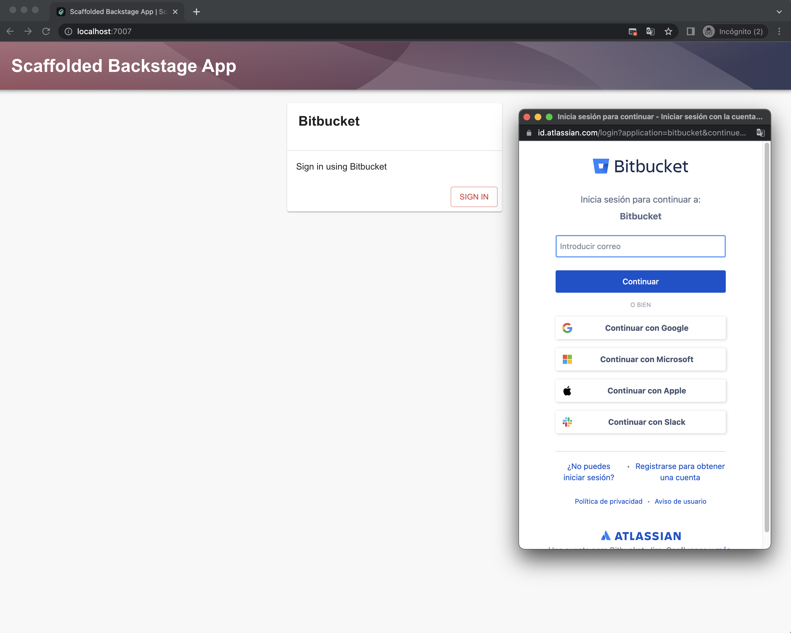
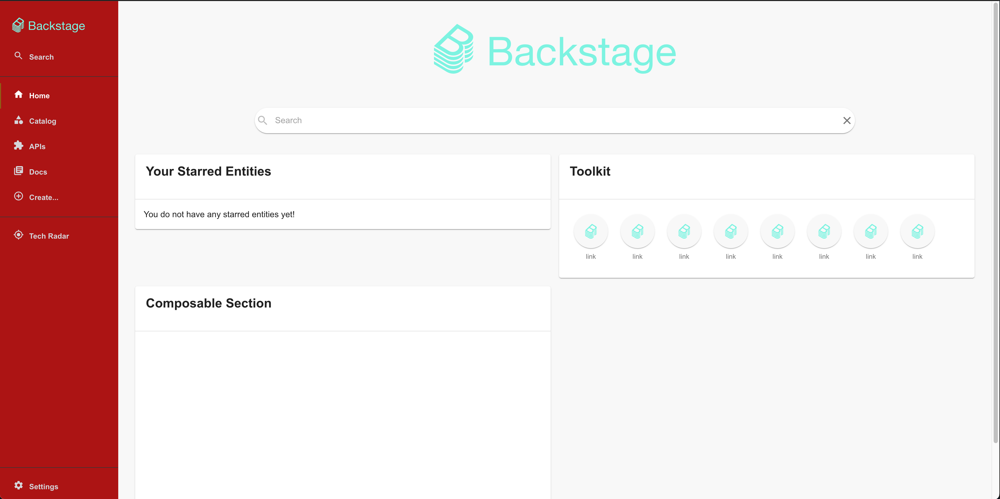
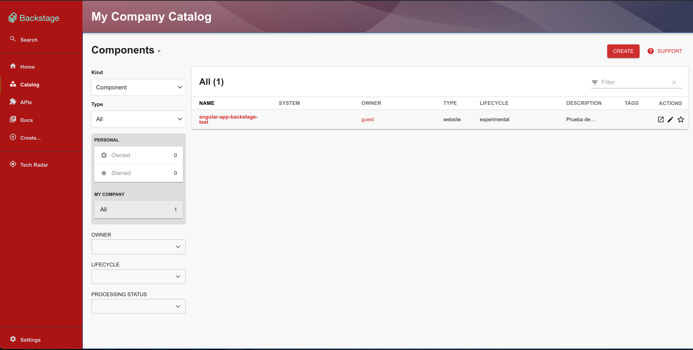
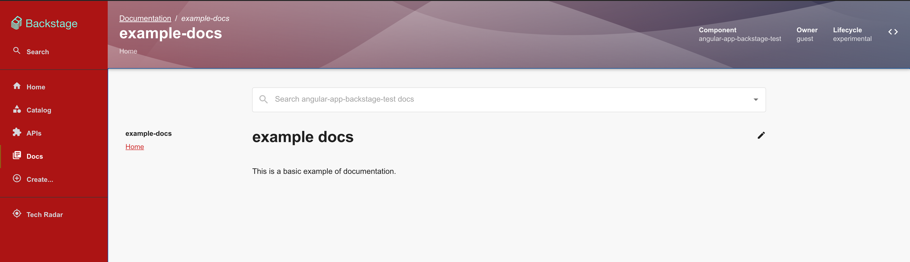
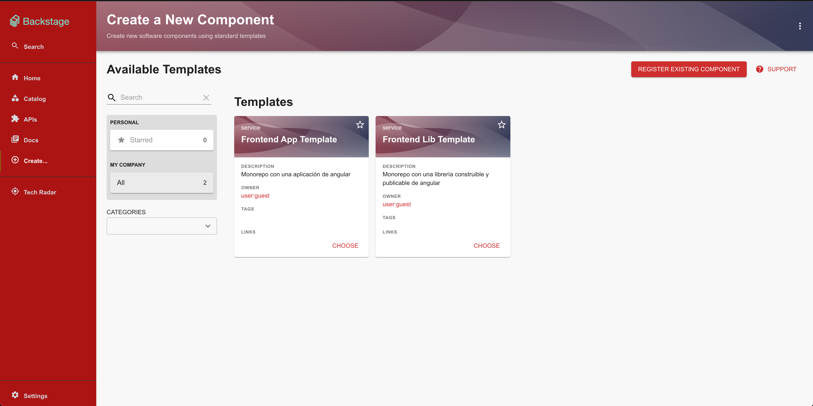
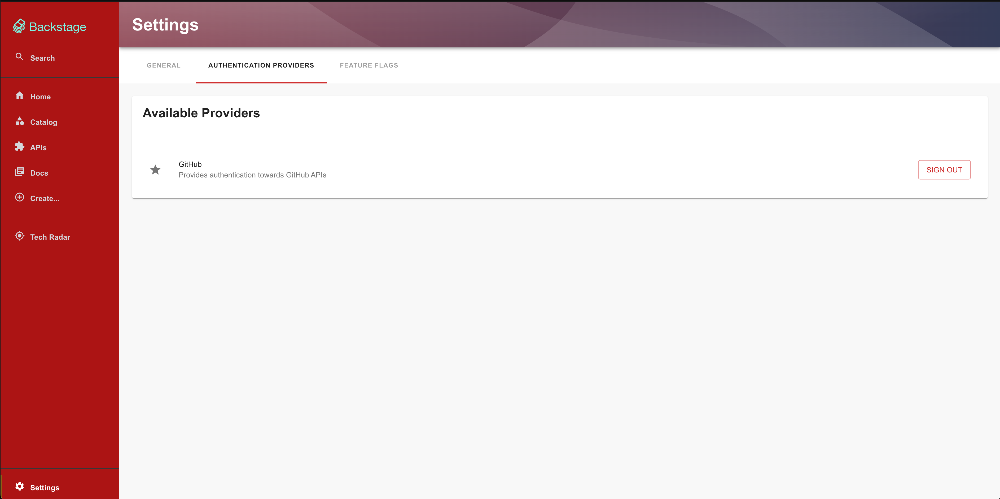

# [Backstage](https://backstage.io)

## Requirements

* Node 16
* Yarn
* Docker / Docker Compose

## Build and running

* Create a new OAuth App in your Bitbucket developer settings: https://bitbucket.org/YOUR_PROJECT_NAME/workspace/settings/api

```
Name: Backstage
Callback URL: http://localhost:7007/api/auth/bitbucket
Permissions: Account - Read, Workspace membership - Read
```

* Copy your Bitbucket Key and Secret, and use as following:

```sh
yarn install --frozen-lockfile
yarn tsc
yarn build
docker compose build
BS_CLIENT_ID="your Bitbucket client ID" BS_CLIENT_SECRET="your Bitbucket secret" docker compose up
```

Open Chrome on http://localhost:7007

## Develop

```sh
yarn install
yarn dev
```

### UI

#### Bitbucket auth

<br>

#### Home page

<br>

#### Catalog

<br>

#### Tech docs

<br>

#### Custom software templates

<br>

#### Github integration

